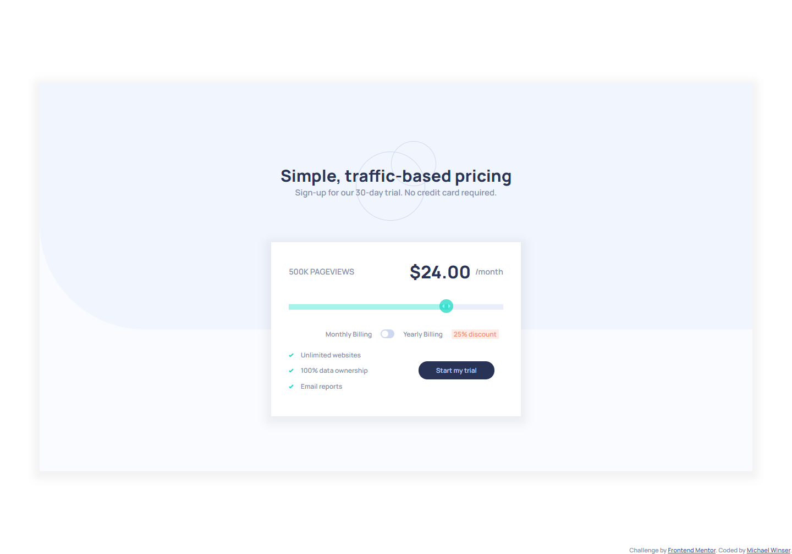

# Frontend Mentor - Interactive pricing component solution

This is a solution to the [Interactive pricing component challenge on Frontend Mentor](https://www.frontendmentor.io/challenges/interactive-pricing-component-t0m8PIyY8). Frontend Mentor challenges help you improve your coding skills by building realistic projects. 

## Table of contents

- [Overview](#overview)
  - [The challenge](#the-challenge)
  - [Screenshot](#screenshot)
  - [Links](#links)
- [My process](#my-process)
  - [Built with](#built-with)
  - [What I learned](#what-i-learned)
  - [Continued development](#continued-development)
- [Author](#author)

## Overview

### The challenge

Users should be able to:

- View the optimal layout for the app depending on their device's screen size
- See hover states for all interactive elements on the page
- Use the slider and toggle to see prices for different page view numbers

### Screenshot



### Links

- Live Site URL: [https://slider-prices.netlify.app/](https://slider-prices.netlify.app/)

## My Process

### Built with

- HTML5
- CSS
- Flexbox
- CSS Grid
- Javascript

### What I learned

Although I did a good job of reviewing the project beforehand and planning the structure, I did not notice the rearrangement of elements in the mobiile view until I'd already finished the desktop view. Ultimately I used CSS Grid to fix this rather than using JS to move around DOM elements on screen size changes.
I don't use CCS Grid that often and was stuck troubleshooting for an hour because I didn't notice that I was putting quotes around my grid-area names: 

To see how you can add code snippets, see below:

```css
#pageviews {
    grid-area: pageviews; //NOT "pageviews"
}
```
I also learned about the touch events available on mobile.

### Continued development

I also learned quite a bit with this project about custom sliders and the work-arounds needed because of browser compatibility issues, but ended up focusing just on Chrome. In the future I'm going to add support for Firefox, Safari and Edge.

## Author

- Website - [Michael Winser](https://mwinser.com)
- Frontend Mentor - [@yourusername](https://www.frontendmentor.io/profile/mwinser)
- Twitter - [@winsaurus](https://www.twitter.com/winsaurus)

